# **React Native Documentation** 
<div align="center">
    
</div>

<br/>

## **1. Setup Development : NodeJS, React Native CLI, Android Studio, Setup Global Enviroment…**
**[click here](https://medium.com/@prasadjivane/react-native-environment-setup-on-windows-10-47a3b5e833b9)**

<br/>

## **2. Overview of React Components: Stateful Component – Stateless Component**

Core APIs React Native : Text, View, StyleSheet, Components, FlatList.
<div align="center">
    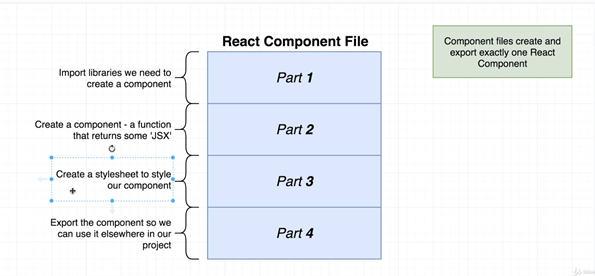
    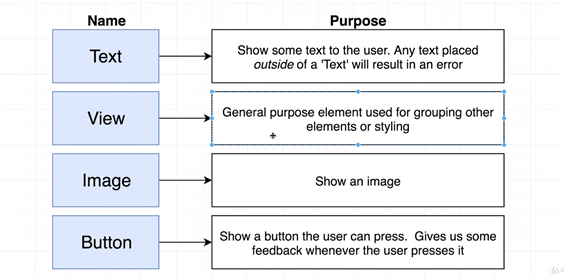
</div>

Câu hỏi:
<div align="center">
    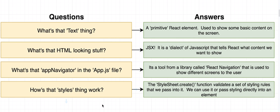
</div>

***

### ***JSX là gì?***
```javascript
    const element = <h1>Codingwithvudang</h1>;
```

Cú pháp thẻ này không phải là một chuỗi kí tự cũng không phải là một thẻ HTML

Nó được gọi là JSX, là một cú pháp mở rộng cho JavaScript. Chúng tôi khuyến khích sử dụng JSX với React để mô tả giao diện (UI). JSX có thể trông giống Ngôn ngữ Khuôn mẫu (Template language), nhưng JSX đi kèm với toàn bộ tính năng của JavaScript.

<div align="center">
    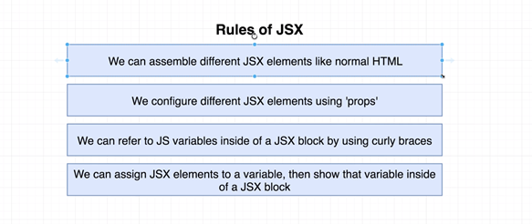
</div>

#### **Bài tập JSX:**
<div align="center">
    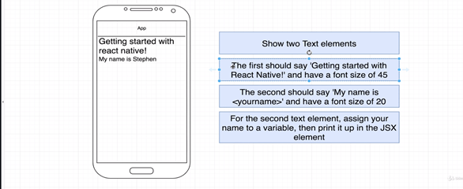
</div>

***

### ***FlatList:***
<div align="center">
    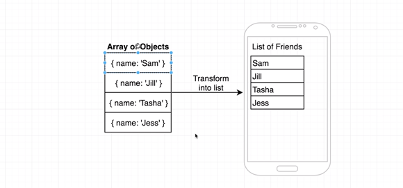
</div>

>***Chú ý về keyExtractor, Data Source và Render Method.***


<div align="center">
    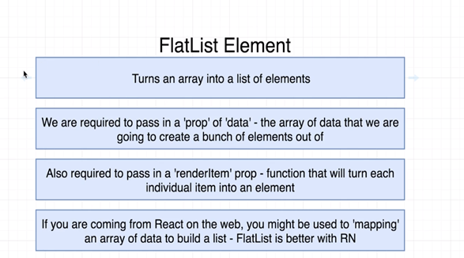
</div>

> ***Item trong list phải có Unique ID***

<div align="center">
    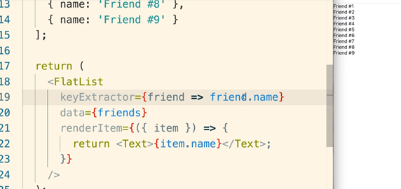
</div>

<br/>

#### **Bài tập FlatList:**
<div align="center">
    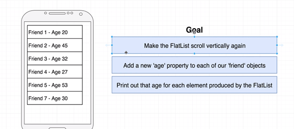
</div>

<br/>

## **3. Navigation & Button – Building Resusable Component**
### **1. Button Types**
<div align="center">
    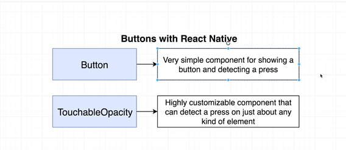
</div>

```javascript
<Button title='login' onPress={()=> doSomeThing()}/>

<TouchableOpacity onPress={()=> doSomeThing()}>
    <Text>click</Text>
</TouchableOpacity>
```

***

### **2. Navigation**
**[click here](https://reactnavigation.org/docs/4.x/getting-started/)**

* Demo cho học viên cách dùng StackNavigator
* Props trong React Native
* Giới thiệu về Destructuring trong ES6

#### **Bài tập:**
Tạo 1 Project mới có 3 Screen: **ImageScreen**, **SignupScreen**, **LoginScreen**. Với logic như sau: Khi app được render screen đầu tiên hiển thị là LoginScreen, 1 Button đăng nhập – 1 Button nếu chưa có tài khoản thì đăng kí, 1 button Chuyển tới ImageScreen.

***

### **3. Reuseable Component**
<div align="center">
    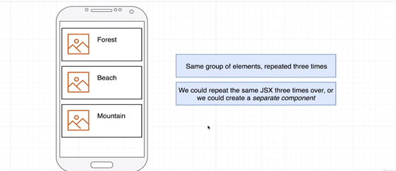
</div>

* Tạo component ImageDetail,ImageScreen dùng FlatList để render ra list hình ảnh kèm Caption.
* Giải thích về Parent To Child và their Communicating thông qua PROPS
* Render Image: <Image source={require(‘Source Image’)}/>

#### **Bài tập:**
<div align="center">
    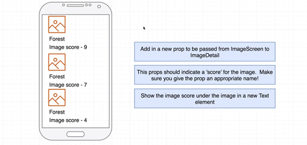
</div>

<br/>

## **4. State Management in React Components**
### ***Props vs State***
<div align="center">
    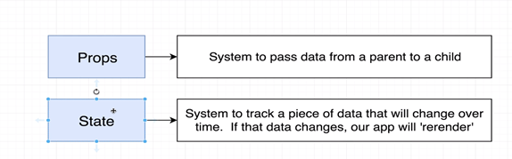
</div>
<br/>

### ***Màn hình mẫu:***
<div align="center">
    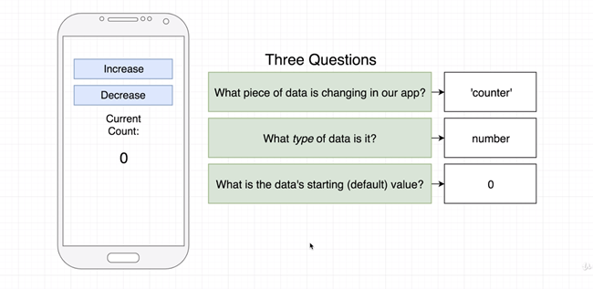
</div>

***<p align="center">Sử dụng useState để thực hiện bài toán trên.</p>***


<div align="center">
    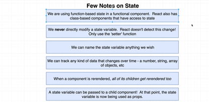
</div>
<br/>

#### **Bài tập: build app sinh màu ngẫu nhiên**
<div align="center">
    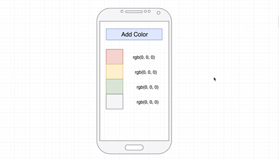
</div>

#### **Giải quyết từng vấn đề nhỏ:**
1. Generating Random Color
<div align="center">
    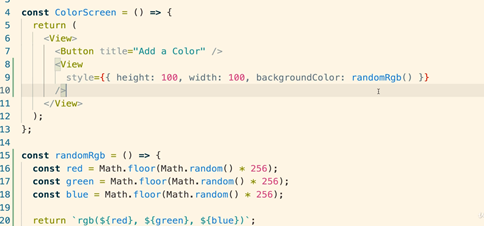
</div>

2. Add random color when button pressed
<div align="center">
    
</div>

3. Showing colors with FlatList (HV tự làm)
<div align="center">
    
</div>
<br/>


#### **Add more features**

<div align="center">
    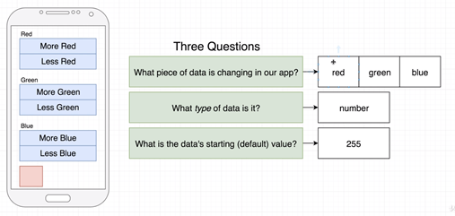
</div>
<br/>


**Color detail screen**

<div align="center">
    
</div>
<br/>


**Xử lý Callback – HV Validation các State này (if else – switch case)**

<div align="center">
    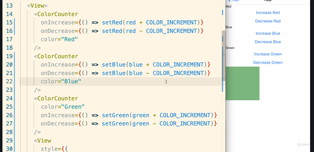
    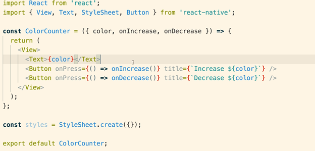
</div>
<br/>


**Overview Reducers: (useReducers) – Refactor Project use Reducers (HV Restore lại Validation)**

<div align="center">
    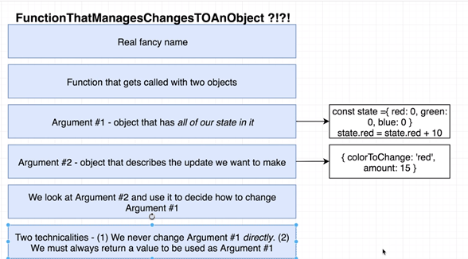
    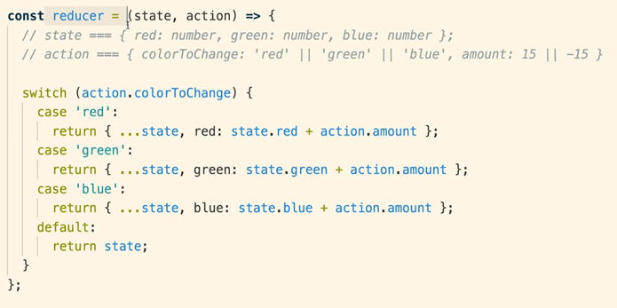
    
</div>

<br/>

**Convention**

<div align="center">
    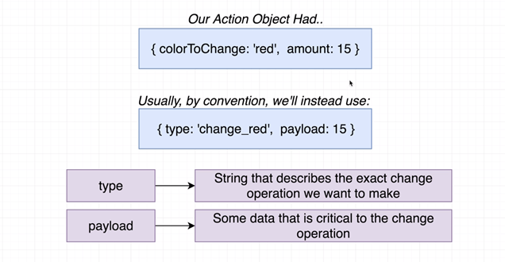
</div>

#### **Bài tập:**
1. Refactor lại Counter Project bằng Reducers
2. Tạo Screen chứa 1 text input ,khi nhập EMAIL thay đổi sẽ hiện thị chữ đó ra màn hình.
3. Tạo Screen chứa 1 text input ,khi nhập Password < 5 kí tự thì thông báo ra người dung.

<br/>

## *5. Layout with React Native*
<div align="center">
    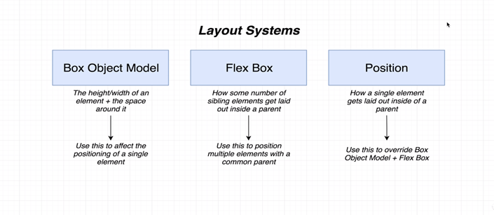
    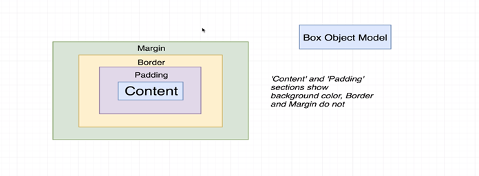
    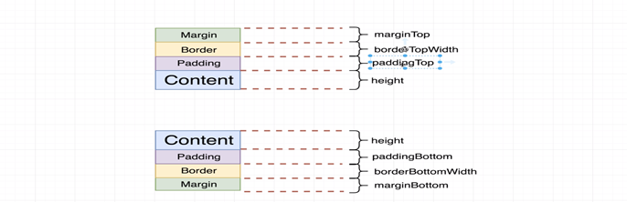
</div>
<br/>

### *1. Align Items with Flex*
<div align="center">
    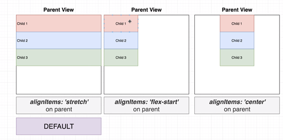
</div>
<br/>

### *2. Flex Direction*
<div align="center">
    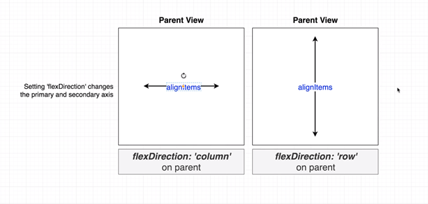
</div>
<br/>

### *3. Justify Content*
<div align="center">
    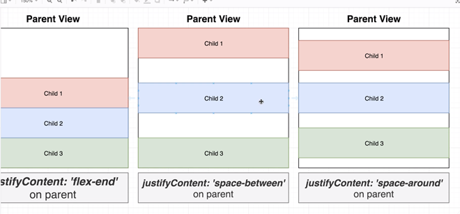
</div>
<br/>

### *4. Flex Value*
<div align="center">
    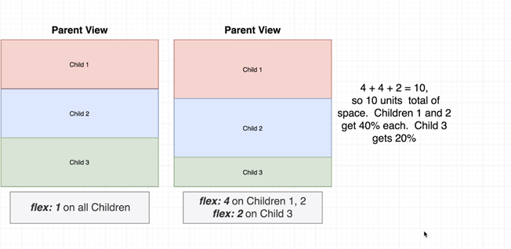
</div>
<br/>

### *5. Algin Self on Children*
<div align="center">
    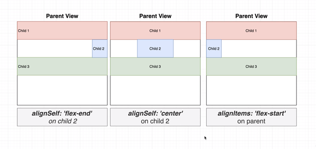
</div>
<br/>

### *6. The position property*
<div align="center">
    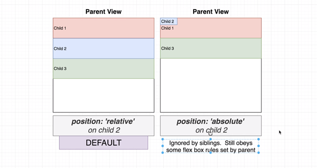
</div>
<br/>

### *Bài tập:*
<div align="center">
    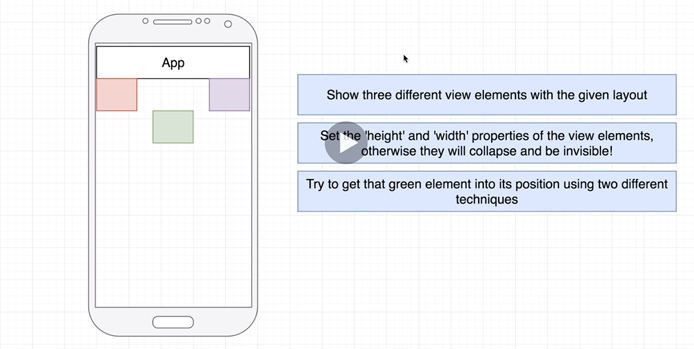
</div>

### *solve:*
<div align="center">
    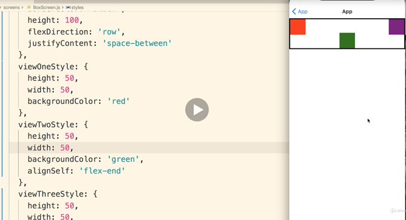
</div>
<br/>

## **7. Bulid Restaurant App**
### **1. App overview**
<div align="center">
    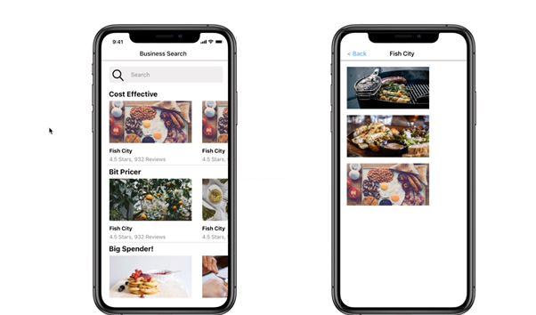
</div>
<br/>

### **2. Project Generation**
<div align="center">
    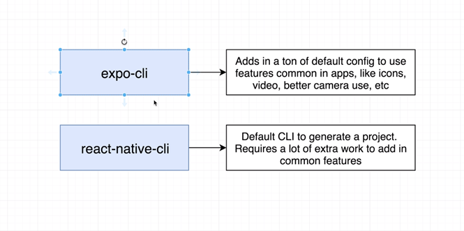
</div>
<br/>

### **3. Yelp API**
```javascript
'Bearer owzvjvtFJ-AKuqrgzBhtBORgTqJs7ktzLIOgjySNREWwZqr42YHFTikgSGMtvBa75MXQYQiImfTogprJQ9gAHkmtHjMEoMVEXZZAoWf8J5g2OC3v1ZiJspjP00tQX3Yx'
```

### **4. Types of Navigation:**
<div align="center">
    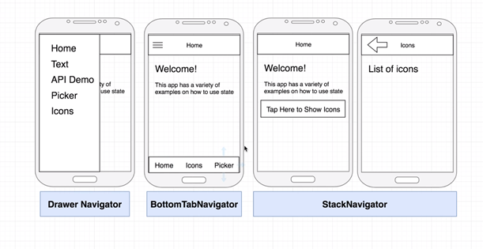
</div>
<br/>

### **5. React Navigation V4 Installation:**
1. Install React Navigation
```javascript
npm install react-navigation
```
or
```javascript
yarn add react-navigation
```
2. Install Dependencies
```javascript
expo install react-native-gesture-handler react-native-reanimated react-native-screens react-native-safe-area-context @react-native-community/masked-view
```
3. Install React Navigation Stack
```javascript
npm install react-navigation-stack @react-native-community/masked-view
```
or 
```javascript
yarn add react-navigation-stack @react-native-community/masked-view
```
4. Start the app and clear cache 
```javascript
expo r -c
```

### **6. Update imports**
Our imports in the upcoming lecture will now look like this:
```javascript
import { createAppContainer } from 'react-navigation';
import { createStackNavigator } from 'react-navigation-stack';
```

### **7. Errors?**
If you are still seeing errors and complaints about versions, you can try an upgrade:
```javascript 
expo upgrade
```
```javascript
expo r -c
```

### **React Navigation v4 Docs:**
**https://reactnavigation.org/docs/4.x/getting-started**

### **GitRepo:**
**https://github.com/giavudangle/foodSearching**


